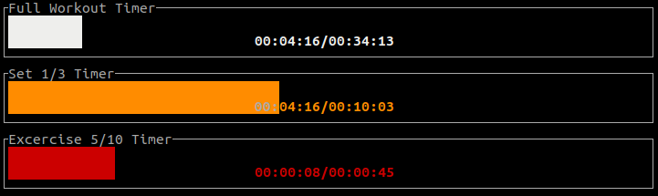
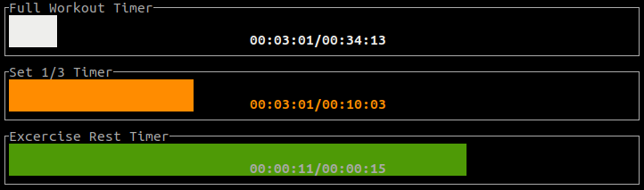
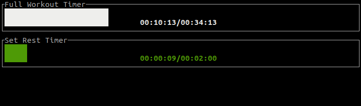

# Motivation
My motivation for this project was to learn the `Rust`` language. I also thought it would be cool to have terminal app for managing my excercises. The project is similar to many already existing applications for smartphones.
# How to run
Project was developed using `Rust`. In order to build and run the app you need to have it installed along with `cargo` package. Once you cloned the repository, run below command in the repo root.
```console
cargo build
cargo run
```
# Demo
## Active excercise

## Rest between excercises

## Rest between sets

